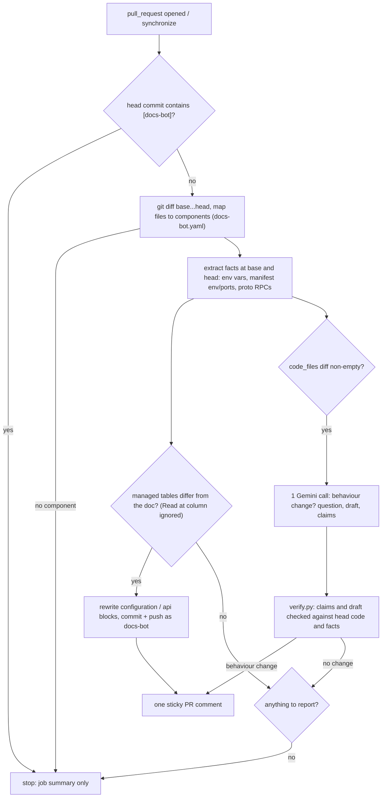

# docs-bot (proof of concept)

A GitHub Action that runs on every pull request and checks whether the change makes a component's
documentation outdated. **Facts** (env vars, defaults, manifest values, RPCs) are extracted by scripts
and committed to the PR branch automatically. **Behaviour** changes are interpreted by one LLM call, but its
prose is never committed: it is posted as a question for the PR author, with a draft whose citations
have been checked against the code.



## Doc format

`docs/components/<name>.md` has three kinds of section:

| Tag | Owner | What the bot does |
| --- | --- | --- |
| `[extracted]` with `<!-- docs-bot:begin/end NAME -->` | script | Regenerates the `configuration` and `api` tables and commits them |
| `[LLM, cited]` | LLM, reviewed by a human | Only proposes a new version, in the PR comment |
| `[owner]` | human | Never touched; given to the LLM as read-only context so drafts don't contradict known caveats |

`<!-- docs-bot:meta source-commit=SHA -->` records the commit the facts were taken from. A pure line
shift is not a change: the configuration table is only rewritten when a (name, default, manifest value)
changes, and then its line numbers are refreshed too. Whether a variable is *required* is deliberately not
extracted: that depends on meaning (some reads sit inside `try/except`), so it belongs in prose.

## How it maps to the full design

| Full design | This PoC |
| --- | --- |
| Org-wide GitHub App | One GitHub Action in one repo (`.github/workflows/docs-check.yml`) |
| Discover (find components, their code and owners) | Hand-written `docs-bot.yaml` |
| Generate, keep fresh, cross-repo "Where it fits" | Only the PR-time "keep fresh" loop |

The code is generic over components; the demo configures only `recommendationservice`.

## Setup

1. Enable GitHub Actions on the fork.
2. Add the repository secret `GEMINI_API_KEY` and the repository variable `GEMINI_MODEL` (a free-tier
   Flash model id). Without them the bot still runs and commits facts, and notes that the behaviour check was skipped.
3. To add a component, add an entry to `docs-bot.yaml` and a doc containing the two managed blocks.

Local run (no token: the comment is printed instead of posted; dry run: no commit or push):

```bash
pip install -r tools/docs_bot/requirements.txt pytest
pytest tests/docs_bot
GITHUB_EVENT_PATH=event.json DOCS_BOT_DRY_RUN=1 python -m tools.docs_bot.main
```

where `event.json` holds `{"pull_request": {"number": 1, "base": {"sha": ...}, "head": {"sha": ..., "ref": ...}}, "repository": {"full_name": ...}}`.

## Metrics

Each run writes `docs-bot-run.json` (uploaded as the `docs-bot-run` artifact) and a table in the job summary:
`pr`, `components_touched`, `fact_changes`, `factual_update_committed`, `llm_called`, `llm_latency_ms`,
`llm_attempts`, `tokens`, `behaviour_change`, `confidence`, `claims_total`, `claims_dropped`,
`action` (`commit|ask|commit+ask|none|skipped`), `error`, `llm_error`, `note` and `duration_ms`.
Across runs these give precision (how often the bot asked and was right), cost (tokens per PR) and failure rate.

## Failure behaviour

- **Fail open.** Any error sets `action: skipped` and updates the sticky comment to "docs check skipped",
  and the job still succeeds. The workflow steps are also `continue-on-error`.
- **LLM down or no key.** 429/5xx get 3 attempts, waiting 5 s then 15 s, or as long as Gemini's RetryInfo asks
  on a 429 (capped at 60 s). After that the factual update is still committed, and the comment says the
  behaviour check was skipped and why (e.g. `503 UNAVAILABLE`).
- **Hallucinations.** A claim is dropped unless its file exists, its lines are in range and the cited lines ±2
  contain one of its identifiers. Draft sentences that cite a dropped claim, cite nothing, or mention an env var
  or port the facts don't know about are removed. If more than half of the claims fail, the whole draft is withheld.
- **No noise.** One comment per PR, updated in place. The bot never comments just to say all is well
  (it only refreshes an existing comment).
- **Loops.** Pushes made with `GITHUB_TOKEN` don't trigger workflows, and commits tagged `[docs-bot]` are skipped anyway.

## Future improvements

- tree-sitter instead of regex, so more languages than Python (Go, C#, Node, Java in this repo) can be covered.
- "Where it fits" generated from the cross-repo call graph.
- GitHub suggestion blocks, so a draft can be applied with one click.
- An eval set of labelled historical PRs, to measure precision and recall of the behaviour check.
- Run inside the org-wide GitHub App instead of a per-repo Action.
